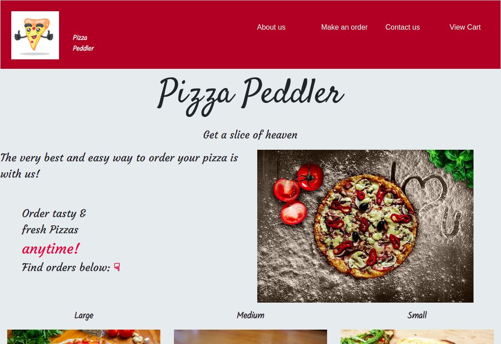

# Pizza Peddlers
### About the Author
 Developed By Kibet Kyle on 01/08/2021
Kibet Kyle is a student at Moringa School who  is aspiring to be a fullstack developer then to fair on and build more other skills in the tech industry. 
### Description
This is a webiste created for my pizza shop; Pizza Peddlers. One can choose the pizza soze they want, a crust of their liking, a suitable pizza topping and the number of pizzas they want to order. It also allows an individual to choose whether to have the pizza dellivered or not. Click the link provided on the live site heading to tour the site.
### Setup/Installation Requirements
Requirements:
    <ol>
        <li>Git</li>
        <li>Github</li>
        <li>Web browser</li>
    </ol>
### Technologies Used
The following languages have been used to develop the project
    <ol>
        <li>HTML</li>
        <li>CSS</li>
        <li>Javascript</li>
        <li>Bootsrap</li>
        <li>JQUERY</li>
    </ol>

### Live site
Here's the link to the project's [live site]()

### Bugs
No bugs have been identified in the project.

### Contact information
cell:  +254705315235 
Mail: kyletrippK@gmail.com

### [license] (mit)

### Website screenshots

